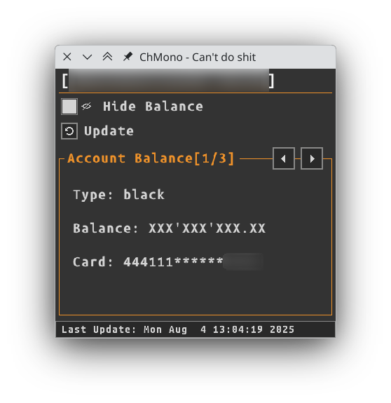

# ChMono
ChMono is a simple GUI app to show you Monobank Account balance.

It utilises simple api provided by Monobank: [https://api.monobank.ua/docs/index.html](https://api.monobank.ua/docs/index.html)

Features:
- Get all accounts
- Show balance
- Update balance info
- Hide balance

<div style="text-align:center"></div>

## Quick start

Requirements:
1. Raylib: [https://github.com/raysan5/raylib](https://github.com/raysan5/raylib)
2. RayGUI: [https://github.com/raysan5/raygui](https://github.com/raysan5/raygui)

Set-up and run:
1. Update [nob.c](./nob.c) to match you `raylib` and `raygui` location
2. Set `MONO_X_TOKEN_HEADER` and `CLIENT_INFO_URL` environmental variabeles (see [.example.env](./.example.env) for more details)
3. Compile and run:
```bash
cc nob.c -o nob
./nob -O3
./build/chmono
```

## References
Dependencies:
1. Build system: [https://github.com/tsoding/nob.h](https://github.com/tsoding/nob.h)
2. Json parsing: [https://github.com/sheredom/json.h](https://github.com/sheredom/json.h)

## License
WTFPL
